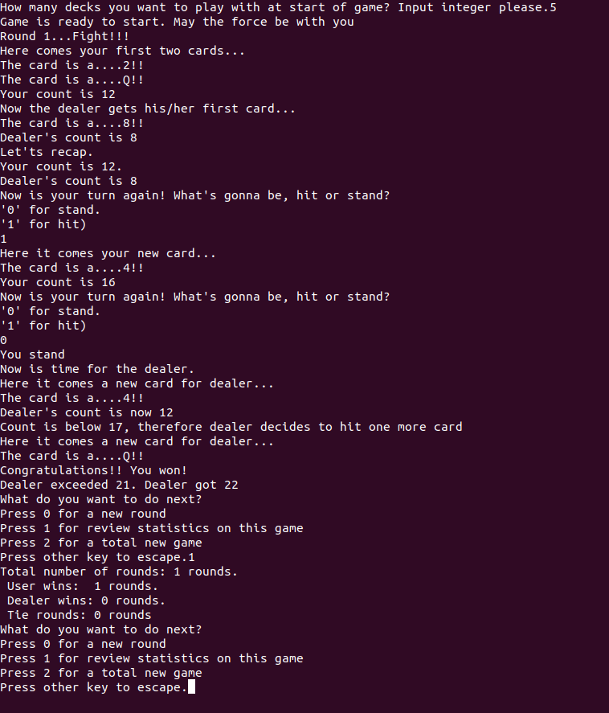

 <div style=></div>

# My BlackJack Game

 <div style="text-align:center"></div>


The scope of [this Ironhack project](https://github.com/sgonzalainen/datamad1020-rev/tree/master/module-1/mini-project) is to code a game.

Among all the options I chose the blackjack game.

Here is a [link](https://en.wikipedia.org/wiki/Blackjack) which describes the general rules of blackjack.

## Description
The following specific features were developed for this game:

* For initial set-up, player is asked to define a number of 52-cards-deck to play with.

* By default, full deck will be reloaded and shuffle after 5 times the number of 52-cards-deck. This is to avoid running out of cards and minimizing the chance of [card counting](https://en.wikipedia.org/wiki/Card_counting).

* Player vs Dealer game (i.e. one single player on table)

* At start of every round, dealer draws two cards to player and one single card for him/herself.

* It is a tie when player and dealer get same score, meaning no difference between a natural 21 hand and 21-valued hand with several cards. 

 <div style="text-align:center"></div>

 
 ## Future developments
 * Allow more players at the table.
 * Include money management.
 * Take into account natural 21 hands.
 * Add more functionalities like allowing split or double strategies.


 # Environment
 Python3 on Ubuntu 20.04
 
 *Sox* package is required for playing effect sounds.
 On Ubuntu, it can be installed as follows:

 ```git
sudo apt-get install sox
```
